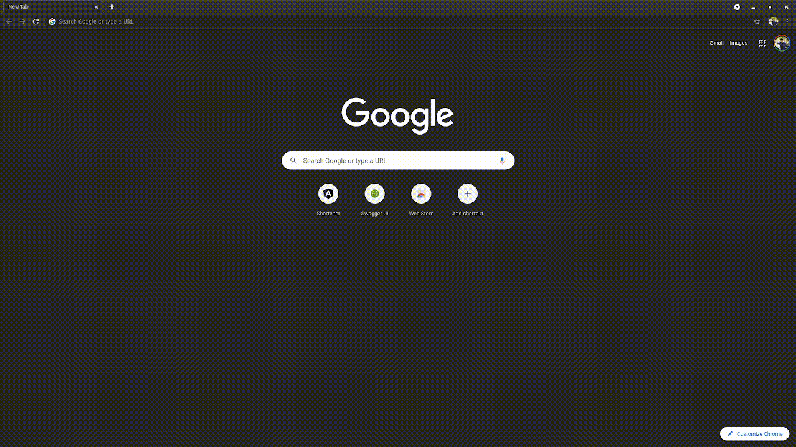

# URL Shortener

Springboot + Angular Application that gets URL from user and gives a short URL.
Persists data in H2 database

## Tech Stack
* Springboot + JPA Repository
* Swagger API Documentation
* Angular UI
* H2 Database
* Docker
* Makefile

## Project Structure
```text
─ url-shortener
    ├── docker-compose.yaml
    ├── Dockerfile         
    ├── LICENSE    
    ├── Makefile             
    ├── pom.xml              --> Parent pom.xml
    ├── README.md
    ├── shortener-api        --> Backend API - (Java / Springboot)
    └── shortener-ui         --> Frontend    - (Angular)
```

### Makefile
This application has a makefile that can be used to perform the below actions
```text
Usage   :  make <target>
Targets :
   clean .........Removes build products
   build .........Builds all Java files
   test ..........Builds and runs all unit tests
   install .......Builds and installs to local repository
   package .......Generates project package.
   start .........Deploys the application in local docker container.
   stop ..........Stops the application in local docker container.
   all ...........Generates project package and deploys it in local docker container.
   docker-build ..Builds the docker image for url-shortener application.
   docker-tag ....Tags the docker image for url-shortener application.
   docker-push ...Pushes the docker image for url-shortener application to docker repository.
   help ..........Prints this help message
```

## Run In local Machine

### Docker Image
To run the application in local docker machine
```shell
$ docker run -p 8090:8090 cksidharthan/url-shortener:latest
```

### Docker Compose
To run the application using docker compose, run the below command from root directory.
```shell
$ make start
```

### To Run locally without docker
```text
$ make install
$ java -jar ./shortener-api/target/shortener-api-0.0.1-SNAPSHOT.jar
```

## Access the application
* Access the Web UI - `http://localhost:8090`
* Access the Swagger UI - `http://localhost:8090/swagger-ui.html`

### Application Statistics Endpoints
This application uses Springboot actuator and all the metrics, health and other endpoints are accessible.
To view the available application statistics endpoints, visit `http://localhost:8090/actuator`

### URL Shortening Logic
Currently, the application generates random string using RandomStringUtils Class. In future this will upgraded to generate hashes based on the url specified.

## Application Demo
